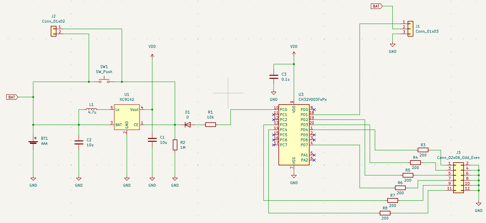

# CH32V003/NP2402 Tiny House

"小さなお家" の各LEDをランダムに順次点灯し，一定時間後に順次消灯する制御ソフトウェア．

## Hardware

### Features

- WCH CH32V003F4P6(TSSOP20)
- Board Size: 55mm x 32mm
- Number of PWM outputs: 6
- Battery: AAA

### Pin Assignment

| GPIO | Description |
| --- | --- |
| PC0 | Output, DC/DC control |
| PC3 | PWM, LED Control |
| PC4 | PWM, LED Control |
| PD1 | SWIO |
| PD2 | PWM, LED Control |
| PD3 | PWM, LED Control |
| PD4 | PWM, LED Control |
| PD7 | NRST/PWM, LED Control |

### Schematics

## Software

### Development Environment

- MounRiverStudio
