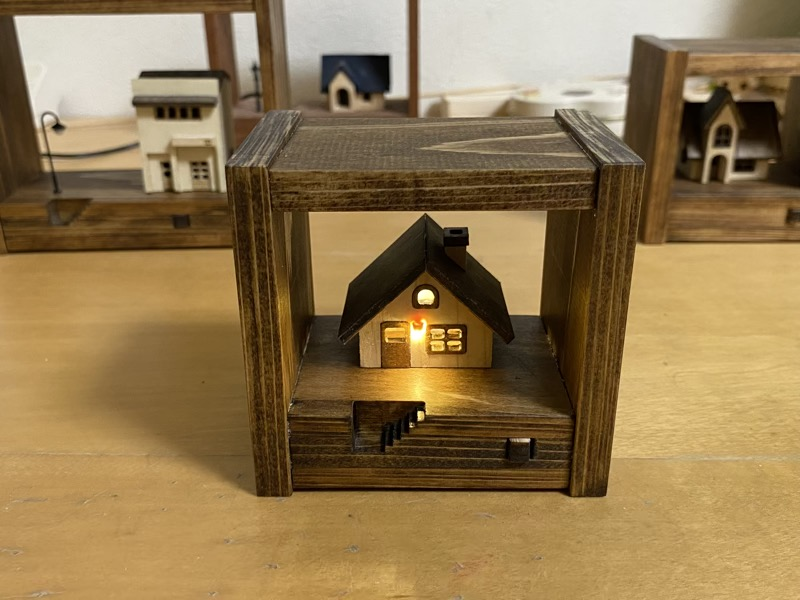
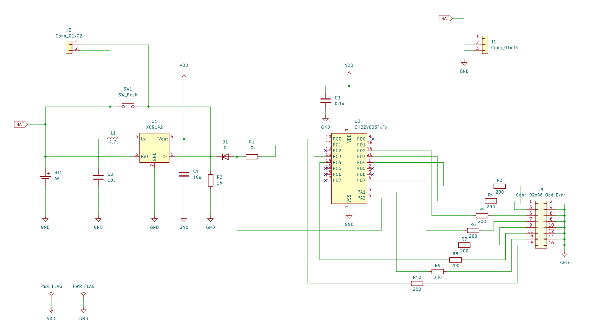

# CH32V003J4M6/NP2403 Tiny House

"小さなお家" の各LEDをランダムに順次点灯し，一定時間後に順次消灯する制御ソフトウェア．

## Hardware

### Features

- MCU: CH32V003F4P6(TSSOP20)
- Board Size: 60mm x 35mm
- Number of PWM outputs: 8
- Button press detection
- Battery: AA

### Pin Assignment

| GPIO | Description |
| --- | --- |
| PA1 | PWM, LED Control |
| PA2 | ADC, Button press detection |
| PC0 | PWM, LED Control |
| PC1 | Output, DC/DC control |
| PC3 | PWM, LED Control |
| PC4 | PWM, LED Control |
| PD1 | SWIO |
| PD2 | PWM, LED Control |
| PD3 | PWM, LED Control |
| PD4 | PWM, LED Control |
| PD7 | NRST/PWM, LED Control |

### Schematics

## Software

### Development Environment

- MounRiverStudio
