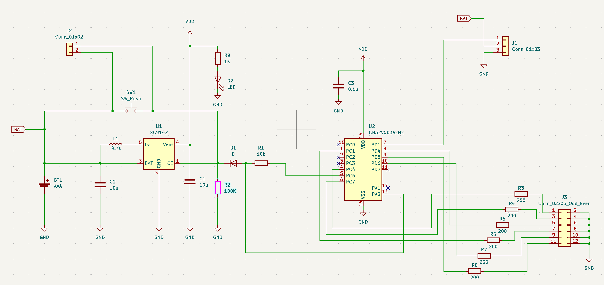

# CH32V003/NP2405 Tiny House

"小さなお家" の各LEDをランダムに順次点灯し，一定時間後に順次消灯する制御ソフトウェア．

## Hardware

### Features

- WCH CH32V003A4M6(SOP16) RISC-V MCU
- Maximum six LEDs
- DC/DC enable control
- Button press detection

### Pin Assignment

| GPIO | Description |
| --- | --- |
| PA2 | ADC, Button press detection |
| PC1 | PWM, LED Control |
| PC4 | PWM, LED Control |
| PC6 | Output, DC/DC control |
| PC7 | PWM, LED Control |
| PD4 | PWM, LED Control |
| PD5 | PWM, LED Control |
| PD6 | PWM, LED Control |

### Schematics

## Software

### Development Environment

- MounRiverStudio
