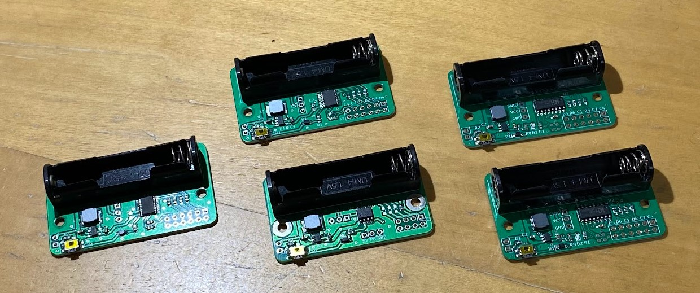

# Projects using CH32V003

WCH社のCH32V003シリーズを使ったプロジェクト．

## Development Environment

- WCH CH32V003 Series RISC-V MCU
- MounRiverStudio v1.91

## Project List

### NP2402 - CH32V003F4P6

- MCU: CH32V003F4P6(TSSOP20)
- Board Size: 55mm x 32mm
- Number of PWM outputs: 6
- Battery: AAA

### [NP2403 - CH32V003F4P6](/NP2403-CH32V003F4P6/README.md)

- MCU: CH32V003F4P6(TSSOP20)
- Board Size: 60mm x 35mm
- Number of PWM outputs: 8
- Battery: AA

### [NP2404/5 - CH32V003A4M6](/NP2405-CH32V003A4M6/README.md)

- MCU: CH32V003A4M6(SOP16)
- Board Size: 55mm x 32mm(NP2404), 53mm x 32mm(NP2405)
- Number of PWM outputs: 6
- Battery: AAA
